Задание: Необходимо реализовать удаленное файловое хранилище, предоставляющее REST API по протоколу HTTP. При реализации разрешается использовать веб-фреймворк, реализующий HTTP-роутинг и работу с HTTP-вызовами.
Путь URL запроса определяет логическое расположение файла в хранилище:
http://storage.com/path/to/file.txt - описывает файл file.txt, находящийся по пути /path/to.
Список поддерживаемых функций:
– загрузка файла в хранилище с перезаписью с помощью метода PUT;
– получение файла из хранилища с помощью метода GET;
– получение списка файлов каталога с помощью метода GET (в качестве формата данных для ответа рекомендуется использовать JSON);
– получение информации о файле (размер в байтах и дата последнего изменения) в виде HTTP-заголовков без получения содержимого файла с помощью метода HEAD;
– удаление файла/каталога из хранилища с помощью метода DELETE.
Необходимо корректно использовать коды состояния HTTP. 
Для тестирования созданной службы использовать утилиту curl или аналоги (Postman, HTTPie, etc). Получение файла или содержимого каталога также должно быть возможным через браузер.
Реализовать функцию копирования файлов в новое расположение.
Пример API (допустимы другие варианты на усмотрение автора):
PUT http://storage.com/path/to/file.txt с установленным заголовком X-Copy-From: /path/toanother/file2.txt для копирования файла

Запуск хранилища.

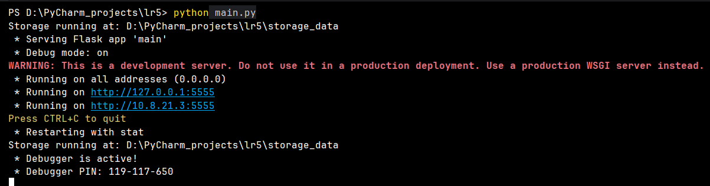

С помощью Postman:

1.	Put-запрос

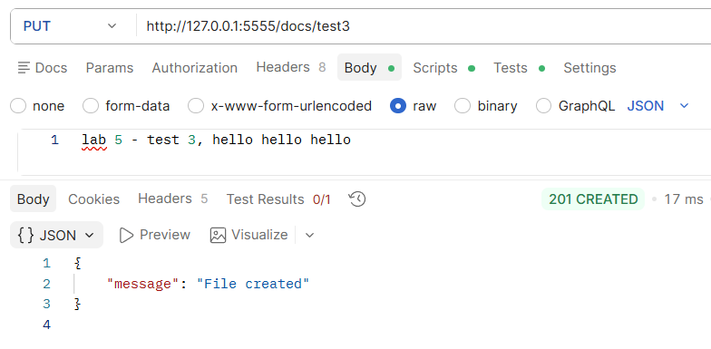

В Wireshark ответ с кодом 201 

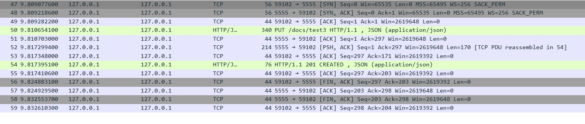

2.	Get-запрос

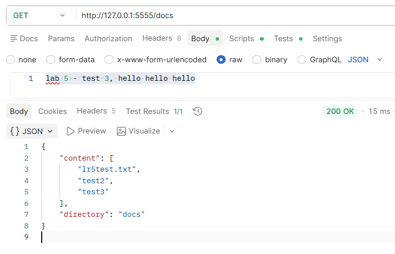

В Wireshark ответ с кодом 200 ОК – успех.

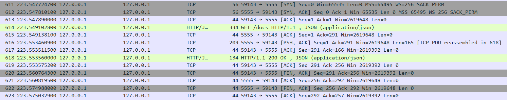

3.	Head-запрос

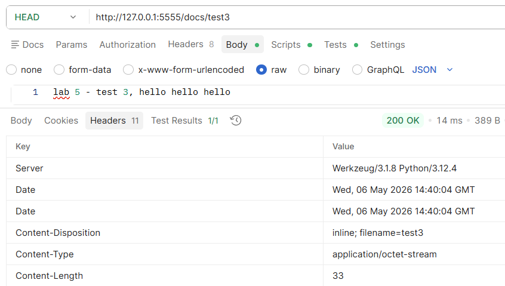

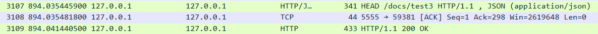

4.	Delete-запрос

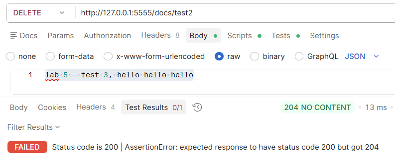

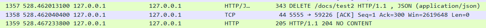

5.	Копирование файла в новое расположение

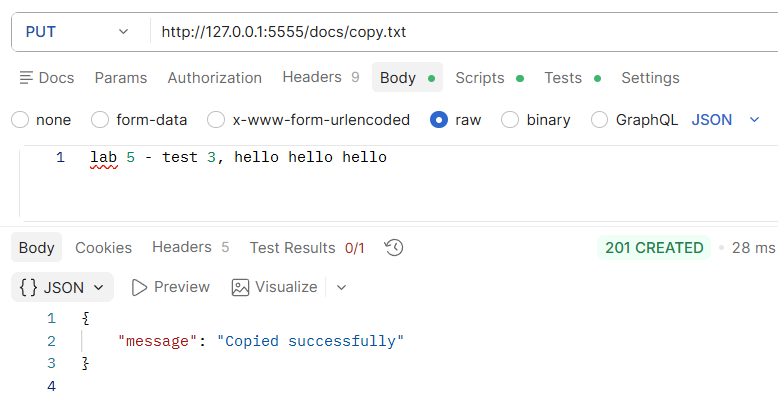

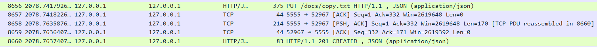

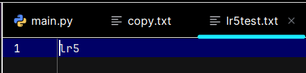

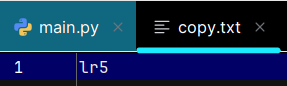