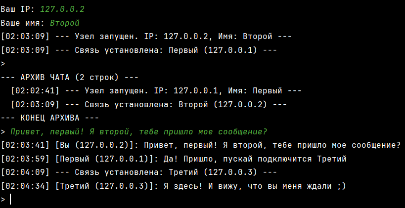
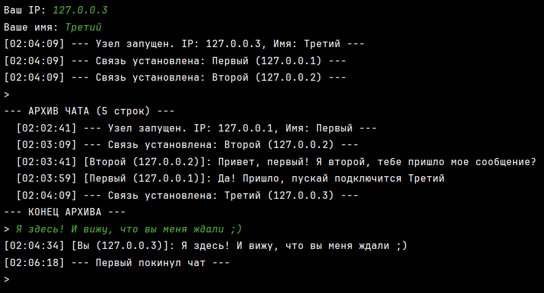
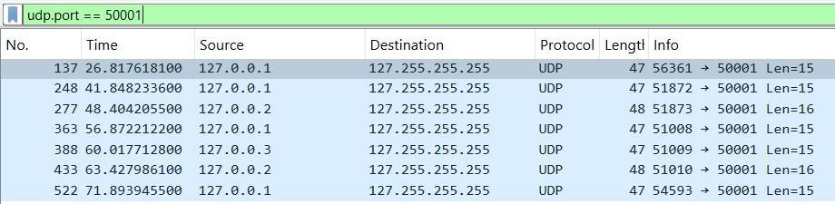
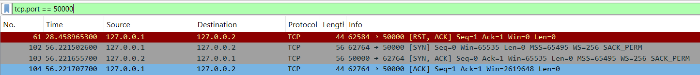
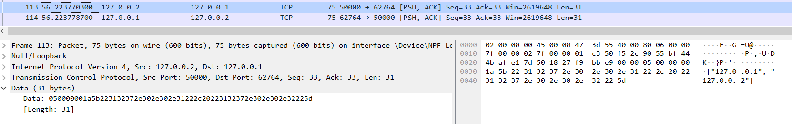
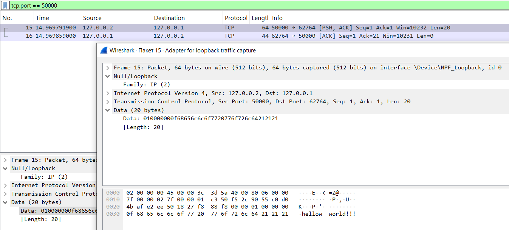
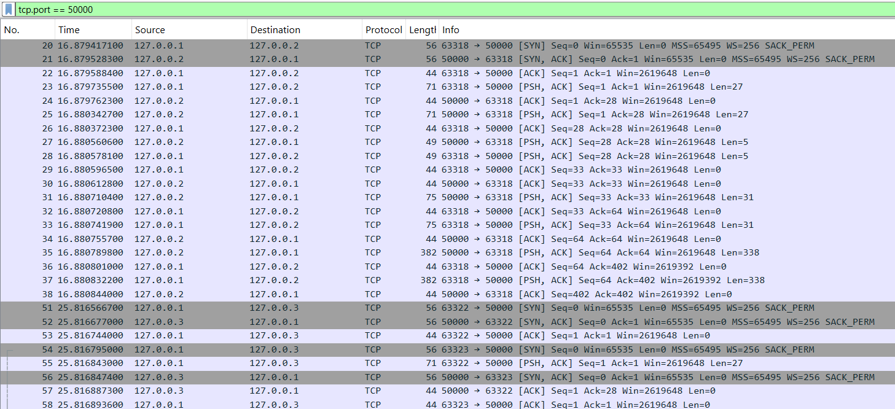
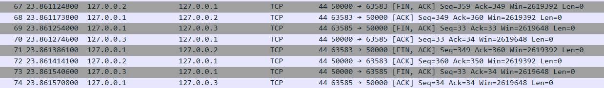
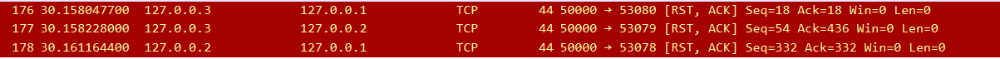

Задание: Необходимо разработать программу (консольную или графическую) для обмена текстовыми сообщениями, работающую в локальной сети в одноранговом режиме. 
Каждый участник обмена сообщениями (узел) идентифицируется IP-адресом и произвольным именем, которое задается пользователем (через параметр командной строки, конфигурационный файл или любым другим способом). Уникальность имен не требуется.
Каждый узел с помощью UDP формирует список активных узлов (IP-адреса и имена):
• после запуска узел отправляет широковещательный пакет, содержащий свое имя, для уведомления других узлов в сети о своем подключении к сети;
• другие узлы, получившие такой пакет, устанавливают с отправителем TCP-соединение для обмена сообщениями и передают по нему свое имя для идентификации в чате.
В любой момент к чату может присоединиться новый клиент.
Обмен сообщениями ведется с помощью TCP в логически общем пространстве: каждый узел поддерживает по одному TCP соединению с каждым другим узлом и отправляет свои сообщения всем узлам в сети. Отключение узла должно корректно обрабатываться другими узлами. 
Пользовательский интерфейс программы должен позволять вводить с клавиатуры и отправлять сообщения, а также просматривать историю событий с момента последнего запуска программы. История включает следующие сообщения в хронологическом порядке с отметками времени:
• входящие сообщения от других узлов (с указанием имени и IP-адреса отправителя);
• собственные отправленные сообщения;
• обнаружение нового узла;
• отключение работающего узла.
Для обмена сообщениями рекомендуется разработать свой собственный формат сообщения, позволяющий передавать сообщения разных типов и упрощающих передачу сообщений в потоковом режиме, используемом в TCP. 
При создании сокетов на прослушивание входящих широковещательных UDP-пакетов и TCP-соединений нужно указывать IP-адрес, переданный при запуске программы (параметр командной строки, конфигурационный файл и т.п.). Далее запустить несколько экземпляров программы. Все эти адреса будут ассоциированы с вашим компьютером, однако логически программы будут разными независимыми клиентами. 
Дополнительное задание:
Реализовать передачу имеющейся истории событий узлу при подключении. После обнаружения узлов новый узел запрашивает у любого имеющегося историю событий. По TCP-соединению, установленному между этими узлами, происходит передача полной истории событий, известной узлу. После приема история должна быть отображена соответствующим образом в пользовательском интерфейсе. 

Работа программы

Программа представляет собой одноранговый (P2P) чат, в котором каждый узел после запуска отправляет широковещательный UDP-пакет со своим IP и именем. Другие узлы, получив этот пакет, устанавливают с ним TCP-соединение и обмениваются именами для идентификации. Дополнительно реализован обмен списком известных узлов, благодаря чему новые участники могут быстро подключиться ко всем уже существующим, даже если не получили их UDP-анонсы напрямую.
Обмен сообщениями происходит по TCP: каждый узел поддерживает по одному соединению с каждым другим узлом и рассылает свои сообщения всем подключенным участникам. Для передачи данных используется собственный формат (тип сообщения + длина + содержимое), что позволяет корректно работать с потоковым протоколом TCP. При конфликте соединений используется правило на основе IP, чтобы избежать дубликатов.
Программа ведет историю событий с отметками времени: сообщения пользователей, подключения и отключения узлов. При подключении новый участник запрашивает историю у одного из узлов и получает её по TCP, после чего она отображается в интерфейсе.

Описание разработанного формата сообщения
Разработанный протокол обмена данными. Для передачи сообщений в потоковом режиме TCP разработан двоичный формат пакета:
•	Заголовок: 5 байт.
Тип сообщения (1 байт): определяет логику обработки (1 — текст, 2 — имя, 3 — запрос истории, 4 — данные истории, 5 — список пиров). Длина полезной нагрузки (4 байта): целое число в формате Big-Endian, определяющее размер следующего за заголовком сообщения.
•	Полезная нагрузка: данные переменной длины (строка текста или JSON-объект), закодированные в UTF-8. Данная структура позволяет однозначно определять границы сообщений в TCP-потоке.

Демонстрация работы программы: 

На скриншоте видна широковещательная рассылка UDP-пакетов на порт 50001 для обнаружения активных узлов в локальной сети (broadcast, loopback).

Пакеты 102-104 доказывают осуществление трехфакторного рукопожатия (SYN, SYN-ACK, ACK) между узлом 127.0.0.1 и 127.0.0.2. Это подтверждает успешное установление надежного TCP-соединения на порту 50000. Бордовым цветом выделен пакет RST (Reset). Это работа механизма разрешения конфликтов: программа обнаружила попытку создания дублирующего соединения и принудительно закрыла лишний сокет, чтобы между парой узлов остался строго один канал связи.

Обмен служебными данными: идентификация узла и передача списка известных пиров (Peer Exchange) в формате JSON.

На скриншоте подробно разобран пакет №15 (флаг [PSH, ACK]), содержащий полезную нагрузку в виде текстового сообщения.
Поле Data: В нижней части скриншота видна структура данных, сформированная функцией pack_msg в коде:
Тип сообщения (1 байт): Первый байт равен 01. Это соответствует константе MSG_TEXT = 1. Следующие байты 00 00 00 0f (в шестнадцатеричной системе) означают число 15 в десятичной системе. Это длина текста «hellow world!!!». В правой колонке видна строка в кодировке: hellow world!!!
Данный скриншот подтверждает корректную реализацию разработанного протокола: сообщение успешно упаковано в заголовок (тип + длина) и доставлено от узла 127.0.0.2 к узлу 127.0.0.1.

При наличии трех узлов, трехфакторное рукопожатие происходит трижды. Серым цветом выделены пакеты, обозначающие начала каждого из трех рукопожатий.

Данные пакеты (с меткой FIN) подтверждают корректную работу механизма штатного завершения TCP-сессии. При вводе команды exit узел вызывает метод shutdown(), уведомляя удаленную сторону о намерении закрыть канал связи, что предотвращает зависание портов в состоянии ожидания и свидетельствует о высокой надежности разработанного сетевого приложения.

Здесь представлен резкий разрыв с флагом RST.
