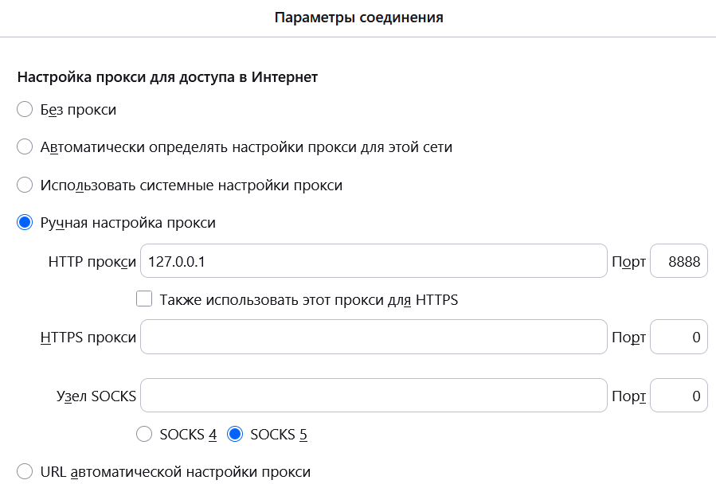
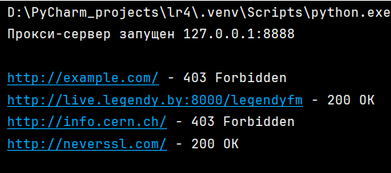
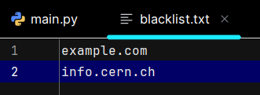
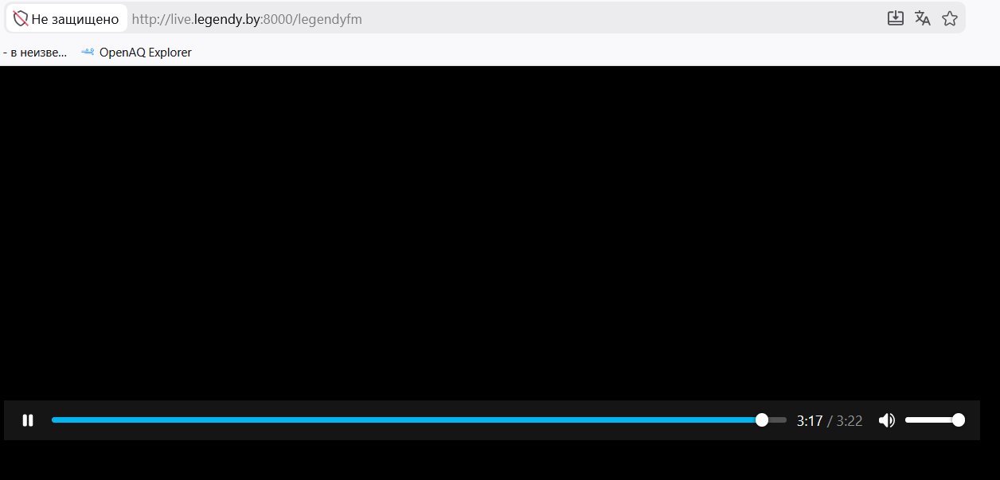
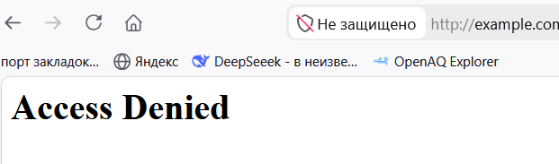
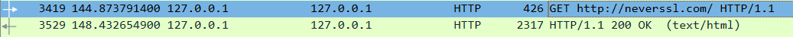
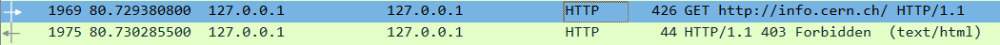
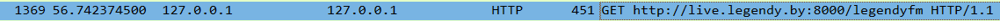
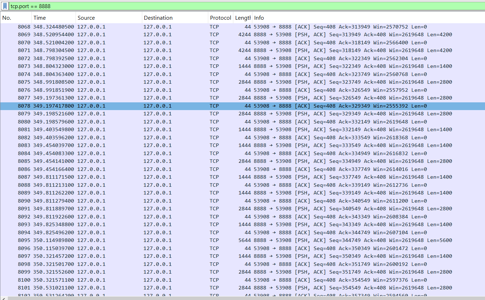
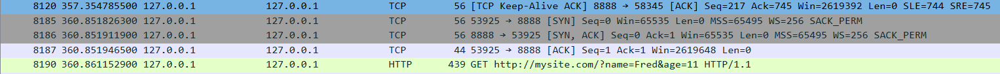

Задание: Необходимо реализовать простой прокси-сервер, выполняющий журналирование проксируемых HTTP-запросов.
Программа должна отображать в консоли журнал с краткой информацией о проксируемых запросах (URL и код ответа).
Обязательной является поддержка HTTP, поддержка HTTPS не требуется.
Для проверки работоспособности необходимо настроить в браузере работу через прокси и попробовать загрузить ресурсы по HTTP:
– http://example.com
– http://live.legendy.by:8000/legendyfm – онлайн радио, необходимо для проверки, что соединение не разрывается раньше времени.
В соответствии с RFC https://tools.ietf.org/html/rfc2616#section-5.1.2 тело HTTP-запроса может содержать как путь, так и URL целиком (абзац 1). При работе через прокси-сервер клиент обязан всегда передавать URL целиком (абзац 3). Также RFC предписывает, что в целях совместимости с будущими версиями HTTP, все серверы должны поддерживать оба варианта, хотя клиенты обязаны использовать полный URL только при работе через прокси-сервер (абзац 4). Как выяснилось на практике, не все серверы работают с полными URL, поэтому необходимо преобразовывать его в путь при передаче серверу назначения того, что было передано прокси-серверу от браузера.
К примеру:
1. Браузер –> прокси-сервер: GET http://live.legendy.by:8000/legendyfm HTTP/1.1
2. Прокси-сервер –> сервер назначения (live.legendy.by): GET /legendyfm HTTP/1.1
Реализовать фильтрацию сайтов по черному списку. В конфигурационном файле для прокси-сервера задается список доменов и/или URL-адресов для блокировки. 
При попытке загрузить страницу из черного списка прокси-сервер должен вернуть предопределенную страницу с адресом, доступ к которому заблокирован, и сообщением об ошибке.

Настройка прокси-сервера в firefox:

 

Запуск программы, прокси-сервер, айпи 127.0.0.1, порт 8888

 

Черный список: 

 

Сайты 

 

 
Эти запросы в Wireshark:

Радио в вайршарке (непрерывный поток):

Установка соединения, GET-запрос

