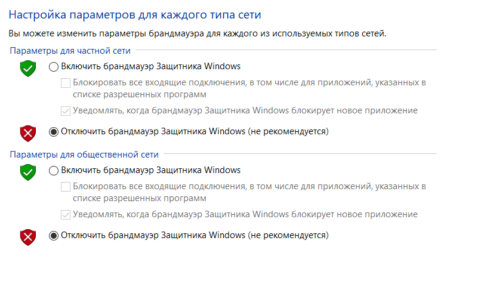
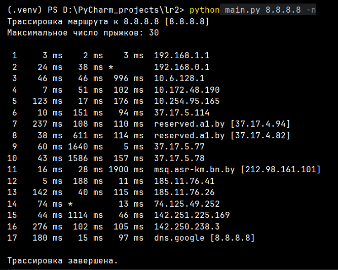
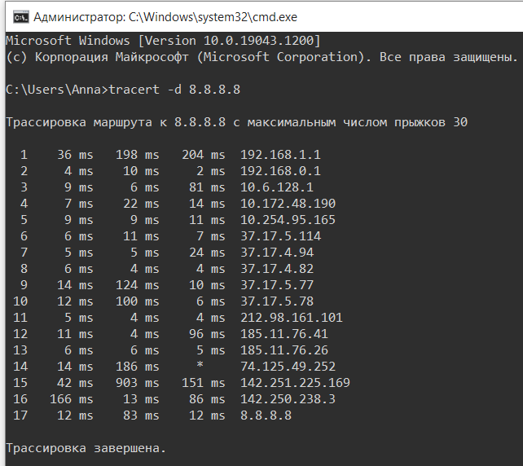
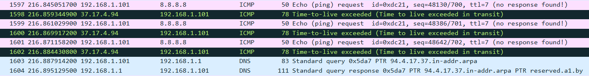
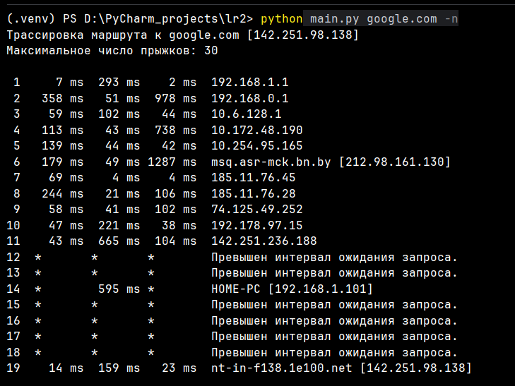
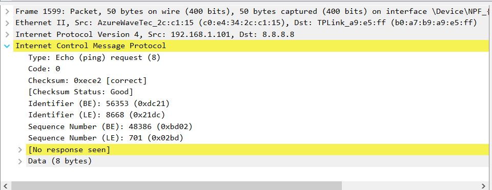

Задание: Необходимо разработать простейший аналог утилиты traceroute / tracert, изученной в рамках первой лабораторной работы. В качестве протокола передачи данных можно использовать ICMP или UDP (на выбор). При реализации использовать программный интерфейс сокетов (готовые реализации отправки/получения echo запросов использовать запрещено). 
Утилита должна принимать в качестве параметра IP-адрес целевого узла и выводить узлы маршрута аналогично системному traceroute / tracert (порядковый номер, время ожидания ответа для каждого отправленного пакета и адрес узла). Следует отправлять более одного пакета. 
Проверьте, что разработанная программа дает такие же результаты, как и системная. Проанализируйте трафик, генерируемый вашей программой в процессе работы, с помощью Wireshark. Также Wireshark можно использовать при отладке, в случае проблем с получением эхо-ответов. 
Обратите внимание на значение контрольной суммы (Wireshark показывает, верно ли оно подсчитано) и обновление значения sequence number между отправками (изучите, как оно изменяется в системной утилите traceroute / tracert). 
ВАЖНО: сетевой экран (фаервол) может блокировать ICMP-пакеты с типом "TTL expired", получение и анализ которых необходим для определения промежуточных узлов на маршруте. Отключите сетевой экран во время тестирования или настройте таким образом, чтобы нужные пакеты не фильтровались. 
Дополнительное задание:
Добавить параметр командной строки, активирующий режим разрешения в имена узлов через обратные DNS-запросы. В этом режиме помимо IP-адресов узлов маршрута должны выводиться и их имена (такое поведение является поведением по умолчанию для системных tracert / traceroute). 
Добавить возможность задавать имя целевого узла вместо его IP-адреса: mytraceroute google.com. 

Для корректной работы разработанной утилиты брандмауэр Windows был временно отключен. Без этого шага программа не могла получить ответы от промежуточных роутеров, и вместо адресов узлов в консоли отображались только таймауты (* * *).

 

Далее показана работа разработанной утилиты при трассировке маршрута до узла 8.8.8.8. Программа выводит порядковый номер каждого промежуточного узла, три замера времени отклика в миллисекундах и соответствующий сетевой адрес. При возникновении потерь пакетов или превышении интервала ожидания программа выводит звездочки. 

 

Далее на скриншоте показан запуск стандартной команды tracert, встроенной в Windows, для того же адреса 8.8.8.8. Если сопоставить этот вывод с работой программы на предыдущем шаге, видно, что цепочка узлов совпадает. Это значит, что код правильно управляет TTL и распознает ответы от промежуточных узлов. 

 

На следующем скриншоте представлен разбор трафика в Wireshark, который генерирует программа во время работы. Розовые строки — это исходящие запросы (Echo request), которые скрипт отправляет к цели. Здесь меняется значение sequence number (700, 701, 702) для пакетов с одинаковым TTL. Темные строки — ответы от промежуточного роутера с адресом 37.17.4.94. Они имеют тип Time-to-live exceeded, так программа узнает адреса всех узлов на пути. В нижней части списка (голубые строки) работа дополнительного задания: виден DNS-запрос, в котором программа спрашивает имя узла для IP 94.4.17.37, и ответ от сервера, сообщающий имя reserved.a1.by. 

На следующем скриншоте показана работа программы при вводе доменного имени google.com вместо цифрового IP-адреса (доп. задание). 

 

Далее представлена информация об ICMP-пакете (Echo-request). Здесь есть подтверждение правильности расчета контрольной суммы. Wireshark пометил поле Checksum как [correct] и [Status: Good], что доказывает правильность работы функции для вычисления контрольной суммы.

